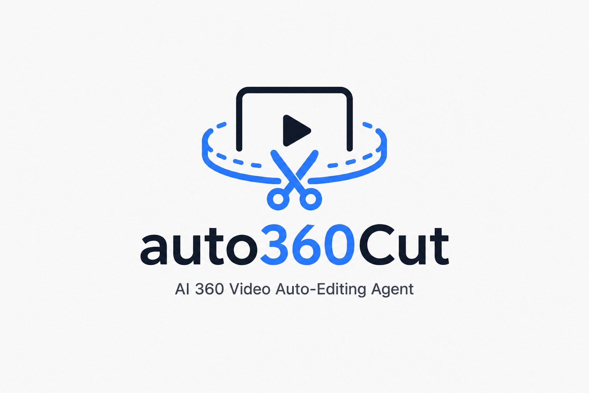
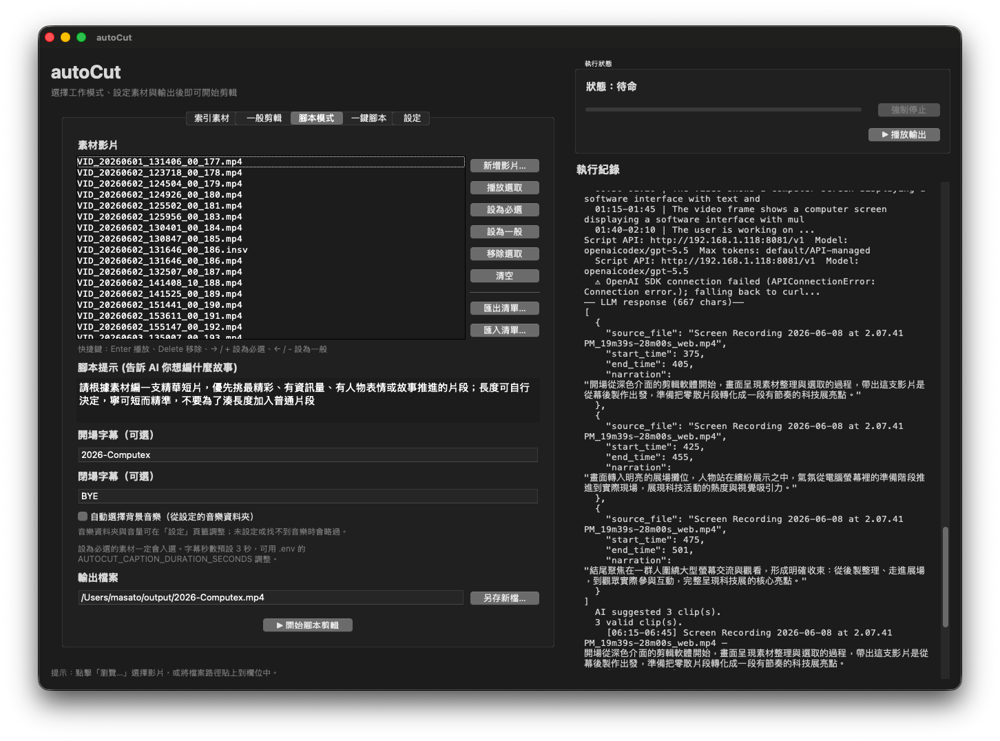
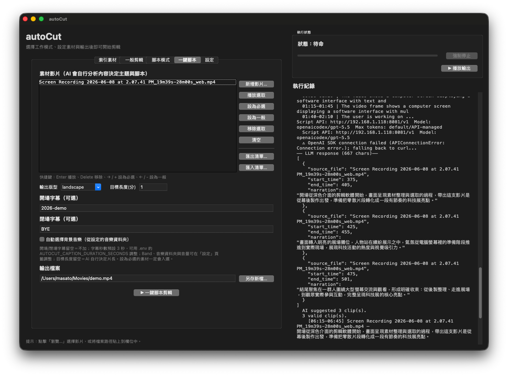

# auto360Cut



[English](./README.md) | [简体中文](./README.zh-CN.md) | 繁體中文

auto360Cut 是一個本地影片剪輯工作流：用 AI 先理解影片內容，再依照 prompt 或自動腳本輸出剪輯成品。它特別適合 Insta360 / 360 相機素材，也可以處理一般 MP4。

核心想法：**用 LRV/低解析檔快速分析，用 HQ MP4 輸出高畫質成品。**

## 介面 Demo





## 主要功能

- 語意搜尋影片片段：用文字描述找出想要的畫面。
- 自動剪輯：挑片段、拼接、輸出 MP4。
- 腳本模式：多支影片交給 LLM 規劃剪輯腳本。
- 360 視角挑選：依照 prompt 自動選 front/right/back/left 等方向並平面化輸出。
- HQ 輸出：LRV 負責 AI 分析，Studio 匯出的 HQ MP4 負責最後成品。
- GUI：一般使用者可用圖形介面操作。
- 可選人臉排序、背景音樂、片頭片尾字幕卡、輸出增強。

## 最快開始

```bash
# 1. 安裝
bash scripts/install.sh

# 2. 編輯 .env，填入你的 AI endpoint/model/key
cp .env.example .env  # install.sh 已建立時可略過

# 3. 檢查環境
./scripts/check_setup.sh

# 4. 開啟 GUI（推薦）
./scripts/run_gui.sh
```

更完整步驟請看：[`docs/quickstart.zh.md`](./docs/quickstart.zh.md)。

## AI 後端設定

編輯 `.env`。最推薦使用 local-api，也就是本機或區網內 OpenAI-compatible VLM server：

```env
AUTOCUT_BACKEND=local-api
LOCAL_API_BASE=http://127.0.0.1:8080
LOCAL_API_MODEL=你的-VLM-model

AUTOCUT_SCRIPT_API_BASE=http://127.0.0.1:8080/v1
AUTOCUT_SCRIPT_API_KEY=not-needed
AUTOCUT_SCRIPT_API_MODEL=你的-文字-LLM-model
```

也支援 Gemini / Qwen Cloud / DeepSeek（腳本 LLM）。範例都在 [`.env.example`](./.env.example)。

## 推薦使用方式：GUI

```bash
./scripts/run_gui.sh
```

GUI 可用來選影片、prompt、HQ 來源、人臉照片、輸出設定等。若 tkinter 未安裝，macOS Homebrew Python 可用：

```bash
brew install python-tk@3.12
```

請把 `3.12` 換成你的 Python 版本。

## 腳本 / 一鍵剪輯模式

多素材剪成一支影片：

```bash
./scripts/run_script_mode.sh ./videos/LRV_001.lrv ./videos/LRV_002.lrv \
  --auto-prompt \
  --output-layout portrait \
  -o ./output.mp4
```

自己指定剪輯方向：

```bash
./scripts/run_script_mode.sh ./videos/LRV_001.lrv \
  -p "剪成一支節奏快、適合社群短影音的旅遊精華" \
  --output-layout portrait \
  --enhance vivid \
  -o ./travel_short.mp4
```

## 單支影片 CLI

```bash
.venv/bin/python autocut.py autocut ./videos/LRV_001.lrv \
  --prompt "first-person perspective, exciting travel moments" \
  --count 3 \
  -o ./preview.mp4
```

使用 HQ MP4 做最終輸出：

```bash
.venv/bin/python autocut.py autocut ./videos/LRV_001.lrv \
  --hq-dir ./hq \
  --prompt "first-person perspective, exciting travel moments" \
  --count 3 \
  -o ./final_hq.mp4
```

## Insta360 / 360 素材流程

```text
相機素材
├─ .lrv    → 給 auto360Cut 做索引、caption、語意搜尋、視角判定
├─ .insv   → 保留原始檔，需要時用 Insta360 Studio 匯出
└─ HQ .mp4 → 給 auto360Cut 做最後裁切與輸出
```

建議流程：

1. 用 `.lrv` 當輸入，讓 AI 快速分析。
2. 用 Insta360 Studio 從 `.insv` 匯出高畫質 equirectangular MP4。
3. 在 GUI 或 CLI 指定 HQ 來源資料夾。
4. auto360Cut 會從 HQ MP4 產生成品。

## 選用功能

### 人臉辨識

```bash
.venv/bin/python -m pip install -e "./sentrysearch[face]"
```

使用時加 `--face ref.jpg`，搜尋結果會優先排序包含該人物的片段。

### 輸出增強

```bash
.venv/bin/python autocut.py autocut ./videos/LRV_001.lrv \
  --prompt "best travel highlights" \
  --enhance vivid \
  -o ./enhanced.mp4
```

可用 preset：`none`、`light`、`vivid`、`cinematic`。

## 文件

- 快速開始：[`docs/quickstart.zh.md`](./docs/quickstart.zh.md)
- 360 使用指南：[`docs/360-video-guide.zh.md`](./docs/360-video-guide.zh.md)
- 開發說明：[`docs/development.zh.md`](./docs/development.zh.md)
- `sentrysearch` fork：[`sentrysearch/README.md`](./sentrysearch/README.md)

## 常見問題

### `Symbol not found: _XML_SetAllocTrackerActivationThreshold`

macOS Homebrew Python 3.14 可能載到系統舊版 expat。優先使用：

```bash
bash scripts/install.sh
```

安裝腳本會自動處理。若要手動處理，請安裝 Homebrew expat 並在建立 venv 時設定 `DYLD_LIBRARY_PATH`。

### `externally-managed-environment`

不要把套件裝進系統 Python。請使用本專案 `.venv`：

```bash
bash scripts/install.sh
```

### local-api 連不上

確認 AI server 已啟動，且 `.env` 使用 client 可以連到的地址。server 監聽可用 `0.0.0.0`，但 `.env` 建議填：

```env
LOCAL_API_BASE=http://127.0.0.1:8080
```

或填實際區網 IP。
